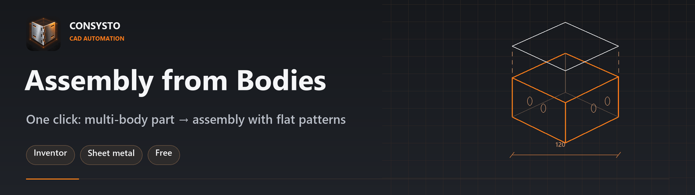
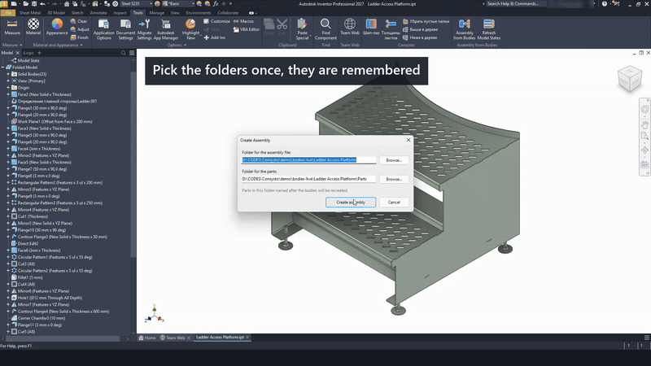
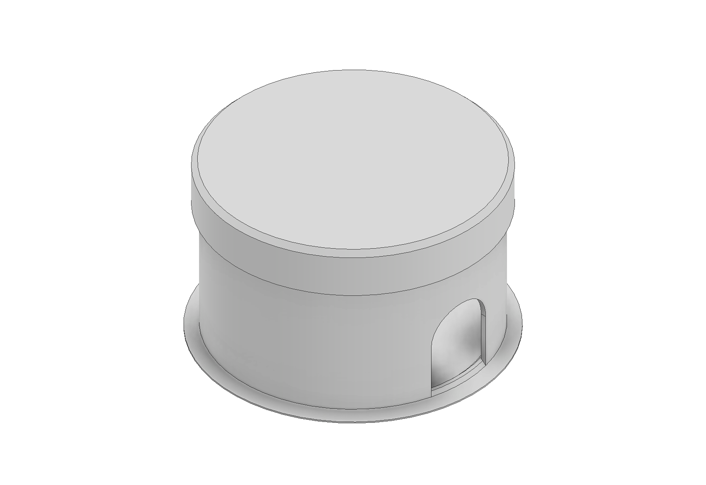
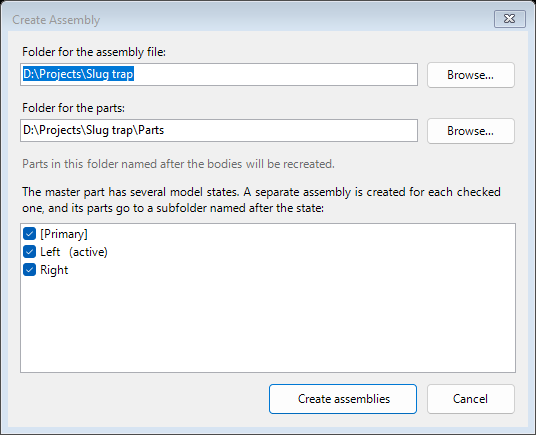
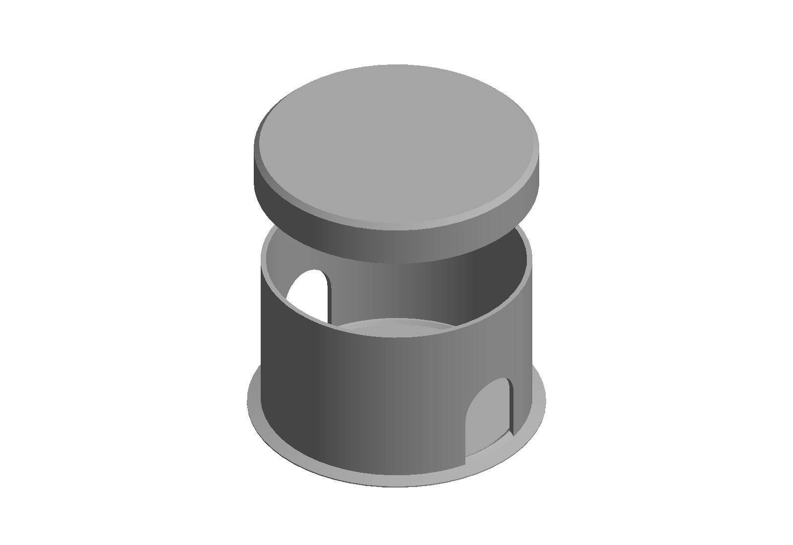

<p align="center">
  
</p>

<p align="center">
  <a href="https://github.com/egorcha174/ConsystoBodies/releases/latest"></a>
  <a href="https://github.com/egorcha174/ConsystoBodies/releases"></a>
  
  
  
</p>

<p align="center">
  <a href="https://github.com/egorcha174/ConsystoBodies/releases/latest"></a>
</p>

<p align="center">
  
</p>

**One click turns a multi-body master part into an assembly of separate parts: every body
becomes its own file, sheet metal or standard, placed exactly where the body was.**

A free add-in for Autodesk Inventor. Windows x64. English and Russian interface.
No administrator rights needed.

[**Download**](https://github.com/egorcha174/ConsystoBodies/releases/latest) ·
[Privacy notice](PRIVACY.md) ·
[Русская версия](README.ru.md)



## The problem it solves

Many designers model a whole product inside one part: the housing, the lid, the ribs, all
together. Dimensions stay linked, and changing one updates the rest.

Production needs the opposite: separate parts, flat patterns for the laser, and an assembly.
Getting there by hand means pushing every body into its own file, picking a template for each,
making the flat patterns, and putting everything back in place. With five bodies that is
tolerable. With forty sheet metal parts in a left-hand and a right-hand version it is half an
hour of identical clicks and a chance to make a mistake in each one.

## What it does

- Every body becomes a separate part, placed in the assembly exactly where it was in the master.
- Sheet metal or standard is decided from the feature that created the body, so sheet metal
  parts come out with a working flat pattern. The add-in follows the body through split, mirror,
  pattern and combine chains rather than guessing from the master's type.
- If a type cannot be determined safely, it asks instead of guessing. Clicking a body name in
  the dialog highlights that body in the graphics window.
- Assembly parameters are linked to the master part, and iProperties are carried over.
- If the master has several model states — a left and a right hand, for example — a separate
  assembly is built for each checked state, with its parts in a subfolder named after it.
- Before building you choose where the assembly file and the parts go. The choice is stored in
  the master part, so it is not asked again.



A second command, **Refresh Model States**, deals with a quiet Inventor habit: a model state is
recomputed only when you activate it. Change the master, and the other states stay out of date
until you visit each one — while it is the out-of-date one that may go to production. The
command activates every state in turn, recomputes and saves it, then updates open parts and
assemblies that reference the master.



## Who it is for

- Inventor users who model products as multi-body master parts.
- Sheet metal designers who need separate parts and flat patterns for cutting.
- Engineers who produce left-hand and right-hand variants from model states.
- Small manufacturing teams that need a production-ready assembly without doing it by hand
  every time the master changes.

## Why not the built-in Make Components

Inventor has **Make Components**, and this add-in uses the same mechanism underneath — derived
parts. The difference is what is left for you to do by hand: picking a template for each body,
making flat patterns, linking parameters, and repeating the whole run for every model state.
This add-in does those steps itself and asks only where it genuinely cannot decide.

## Install

1. Save your work and close Inventor.
2. Run `ConsystoBodies-x.y.z-setup.exe` and pick a language.
3. Open a part. The commands are on the **Tools** tab, **Assembly from Bodies** panel. If the
   panel is missing, enable *Consysto — Assembly from Bodies* in the Add-In Manager.

The installer is not code-signed, so Windows SmartScreen may say it protected your PC: click
**More info → Run anyway**. A certificate costs a few hundred dollars a year, which a free
add-in does not pay for. Every release lists the SHA-256 of its files so you can check that what
you downloaded is what was published:

```powershell
Get-FileHash .\ConsystoBodies-1.0.2-setup.exe -Algorithm SHA256
```

Uninstall through Windows Settings → Apps → Consysto Assembly from Bodies. Your Inventor files
are not touched.

## Requirements and known limitations

- Autodesk Inventor, Windows x64. **Tested on Inventor 2027.** Inventor 2025 and 2026 are
  supported by the same build but have not been checked yet — if something goes wrong there,
  please open an issue and it will be fixed.
- Part templates *Sheet Metal (mm)* and *Standard (mm)* (or *Sheet Metal* / *Standard*) must be
  in the templates folder of the active Inventor project.
- **Running Assembly from Bodies again recreates the part files in the chosen folder.** Anything
  you changed inside a generated part is lost. The master part is the source of truth; the
  generated parts are derived from it.
- The add-in works entirely offline and collects nothing. See the [privacy notice](PRIVACY.md).
- The source code is not published. The add-in is free for personal and commercial use, provided
  as is, without warranty.

## Status

Under review for the Autodesk Design and Make Marketplace. Until it is published there, download
it from the [releases page](https://github.com/egorcha174/ConsystoBodies/releases/latest).

## Author and support

Egor Chayka, design engineer — twenty years of making things that have to be manufactured, not
just modelled.

Bugs, questions and suggestions: [open an issue](https://github.com/egorcha174/ConsystoBodies/issues)
or write to consysto@gmail.com. Telegram channel about design and manufacturing (in Russian):
[@print3d_lasercut](https://t.me/print3d_lasercut).

If this add-in saves you time, you can support further work through
[LAVA.top](https://app.lava.top/egorcha?donate=open) — cards issued outside Russia are accepted.
