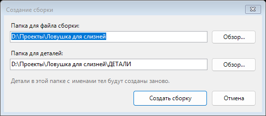

# Consysto — Сборка из тел

**Одной кнопкой превращает многотельную мастер-деталь в сборку отдельных деталей: каждое тело
становится своим файлом — листовым или обычным — и встаёт в сборку ровно туда, где оно было.**

Бесплатное дополнение для Autodesk Inventor. Windows x64. Интерфейс русский и английский.
Права администратора не нужны.

[**Скачать**](https://github.com/egorcha174/ConsystoBodies/releases/latest) ·
[Политика конфиденциальности](PRIVACY.md) ·
[English version](README.md)


## Какую работу снимает

Многие конструкторы рисуют изделие целиком в одной детали: корпус, крышку, рёбра — всё вместе.
Размеры связаны между собой, поменял одно — подтянулось остальное.

Производству нужно обратное: отдельные детали, развёртки для лазера и сборка. Руками это значит
разложить тела по файлам, каждому выбрать шаблон, сделать развёртки и собрать всё обратно на свои
места. Пока тел пять — терпимо. Когда в изделии сорок листовых деталей, да ещё в правом и левом
исполнении, это полчаса одних и тех же щелчков и шанс ошибиться в каждом.

## Что делает

- Каждое тело становится отдельной деталью и встаёт в сборку на своё место.
- Листовая деталь или обычная — определяется по операции, которой построено тело, поэтому
  у листовых сразу готова развёртка. Дополнение прослеживает тело через разрезание, зеркала,
  массивы и объединение, а не судит по типу мастер-детали.
- Если тип определить нельзя, оно не угадывает, а спрашивает. По клику на имя тела в окне
  это тело подсвечивается в графике.
- Параметры сборки связаны с мастер-деталью, свойства перенесены.
- Если у мастера несколько состояний модели — например правое и левое исполнение — для каждого
  отмеченного делается своя сборка, а детали кладутся в подпапку с именем состояния.
- Перед созданием выбираете, куда положить сборку и детали. Выбор запоминается в мастер-детали
  и больше не спрашивается.



Вторая команда — **«Прокатать состояния»**. У Inventor есть тихая привычка: состояние модели
пересчитывается, только когда его откроешь. Поправил основную версию — остальные так и остаются
старыми, пока в них не зайдёшь. А на производство уходит именно такая. Команда проходит по всем
состояниям, пересчитывает и сохраняет каждое, затем обновляет открытые детали и сборки, которые
ссылаются на мастер.


## Кому пригодится

- Тем, кто рисует изделие многотельной мастер-деталью.
- Конструкторам по листовому металлу, которым нужны отдельные детали и развёртки под резку.
- Тем, кто делает правое и левое исполнение через состояния модели.
- Небольшим производствам, где сборку нужно получать заново при каждой правке мастера.

## Чем отличается от штатной команды

В Inventor есть «Создать компоненты», и внутри у дополнения тот же механизм — производные детали.
Разница в том, что остаётся на руки: тип детали каждому телу назначаешь сам, развёртки делаешь
сам, параметры связываешь сам, и всё это проходишь заново для каждого состояния модели.
Дополнение делает эти шаги само и спрашивает только там, где действительно не может решить.

## Установка

1. Сохраните работу и закройте Inventor.
2. Запустите `ConsystoBodies-x.y.z-setup.exe` и выберите язык.
3. Откройте деталь. Команды — на вкладке **«Инструменты»**, панель **«Сборка из тел»**.
   Если панели нет, включите *Consysto — Сборка из тел* в диспетчере надстроек.

Установщик не подписан сертификатом, поэтому Windows может сказать, что защитила компьютер:
«Подробнее» → «Выполнить в любом случае». Сертификат стоит несколько сотен долларов в год, и
бесплатная программа их не окупает. Зато у каждого выпуска указан SHA-256, чтобы можно было
проверить, что скачалось именно то, что опубликовано:

```powershell
Get-FileHash .\ConsystoBodies-1.0.2-setup.exe -Algorithm SHA256
```

Удаление: Параметры Windows → Приложения → Consysto Сборка из тел. Ваши файлы Inventor
не затрагиваются.

## Требования и ограничения

- Autodesk Inventor, Windows x64. **Проверено на Inventor 2027.** Inventor 2025 и 2026
  поддерживаются той же сборкой, но ещё не проверены — если там что-то пойдёт не так,
  напишите, поправлю.
- Нужны шаблоны деталей «Листовой металл (мм)» и «Стандартный (мм)» (или английские
  Sheet Metal / Standard) в папке шаблонов активного проекта Inventor.
- **Повторный запуск пересоздаёт файлы деталей в выбранной папке.** Всё, что вы правили внутри
  созданной детали, потеряется. Мастер-деталь — источник истины, остальные детали производны
  от неё.
- Дополнение работает без интернета и ничего не собирает. См. [политику
  конфиденциальности](PRIVACY.md).
- Исходный код не публикуется. Дополнение бесплатно для личного и коммерческого использования,
  предоставляется как есть, без гарантий.

## Состояние

Отправлено на модерацию в Autodesk Design and Make Marketplace. Пока оно не опубликовано там,
скачивать со [страницы выпусков](https://github.com/egorcha174/ConsystoBodies/releases/latest).

## Автор и поддержка

Егор Чайка, инженер-конструктор — двадцать лет делаю вещи, которые потом надо изготовить,
а не только нарисовать.

Ошибки, вопросы и предложения: [issue на GitHub](https://github.com/egorcha174/ConsystoBodies/issues)
или consysto@gmail.com. Канал о конструировании и производстве:
[@print3d_lasercut](https://t.me/print3d_lasercut).

Если дополнение сэкономило вам время, поддержать дальнейшую работу можно через
[LAVA.top](https://app.lava.top/egorcha?donate=open) — сервис принимает карты, выпущенные за пределами России.
